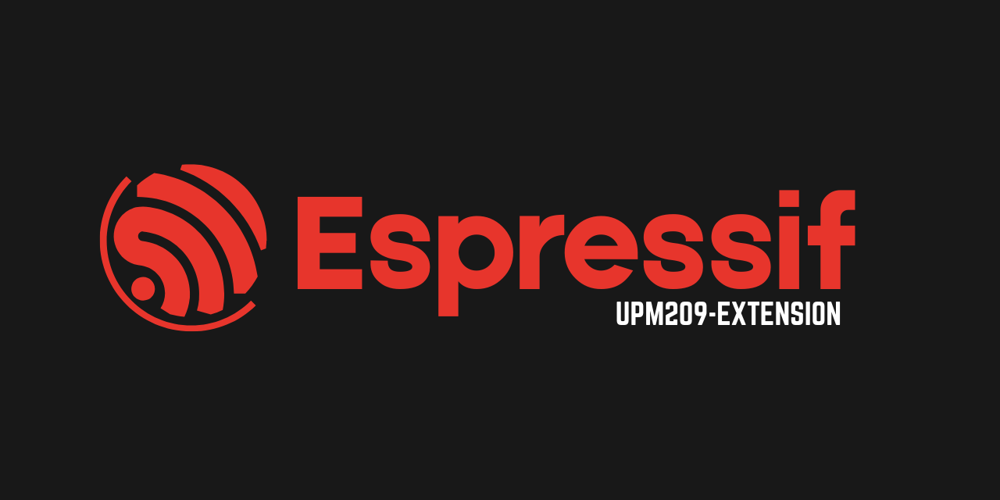

<a href="https://github.com/YounesRabeh/upm209-esp-extension"></a>

<div align="center">

  <p align="center">
    
    
    <a href="https://github.com/YounesRabeh/upm209-esp-extension/releases"></a>
    <a href="LICENSE"></a>
    <a href="docs/README.md"></a>
  </p>

  <p>ESP-IDF firmware for acquiring, processing, and sending UPM209 electrical measurements over HTTP on ESP32-S3.</p>

  <p align="center"><a href="docs/README.it.md">🇮🇹 Leggi il README in italiano</a></p>

  <p align="center">
    <a href="#features">Features</a> •
    <a href="#showcase">Showcase</a> •
    <a href="#quick-start">Quick Start</a> •
    <a href="#development">Development</a> •
    <a href="#guides">Guides</a>
  </p>
</div>

---

## Features

- 📡 Periodic Modbus RTU sampling of the UPM209 register map (default: full range through `0x063E`)
- 💾 Raw-sample buffer in RAM plus a persistent LittleFS queue (`storage` partition)
- 📊 Variable-size window processing (up to 64 samples) with IQR-based outlier filtering
- 🧾 JSON payload generation with device metadata (MAC-derived device ID, firmware version, timestamp)
- 🌐 HTTP POST upload with reconnection and retry logic
- 📶 Network-mode selection: `WiFi only`, `LTE only`, or `AUTO (WiFi -> LTE fallback)`
- 🖥️ Centralized service startup and custom colorized logging

### Data pipeline

```mermaid
stateDiagram-v2
    direction LR

    state "modbus_manager" as ModbusManager
    state "sampling_service" as SamplingService
    state "processing_service" as ProcessingService
    state "internet_send" as InternetSend
    state "Samples removed from queue" as Cleanup

    [*] --> ModbusManager
    ModbusManager --> SamplingService: UPM209 blocks every 10 seconds
    SamplingService --> ProcessingService: raw words in persistent storage
    ProcessingService --> InternetSend: 6 samples → min/avg/max → JSON
    InternetSend --> Cleanup: successful POST to CONFIG_INTERNET_TARGET_URL
    Cleanup --> [*]
```



<details>
<summary><strong>Current runtime defaults</strong></summary>

- Target: `esp32s3`
- ESP-IDF in the lockfile: `6.0.1`
- Modbus (hardcoded in [`components/modbus/modbus_manager.c`](components/modbus/modbus_manager.c)):
  - UART port: `1`
  - TX: `GPIO7`
  - RX: `GPIO8`
  - RTS/DE: `GPIO4`
  - Baud rate: `19200`
  - Parity: `none`
  - Slave address: `1`
  - Polling interval: `10000 ms`
- Processing window: `6` samples
- LittleFS queue capacity: `262144` bytes (configurable)

</details>

### Notes and limitations

> [!WARNING]
> LTE is currently a stub implementation ([`components/lte/lte.c`](components/lte/lte.c)) and does not yet control a real modem.

- Default ESP-IDF logs are silenced in `app_main`; use the project `LOG_*` logs for diagnostics.
- For quick switches (`simple/full`, `dev on/off`, verbose debug, network/services), see [Development](#development).

## Showcase

Runtime screenshots are not currently included in the repository.

## Quick start

### Prerequisites

- ESP-IDF installed (the lockfile uses `6.0.1`)
- A working ESP32-S3 board/toolchain (`idf.py --version`)
- A UPM209 meter connected through an RS485 transceiver

### Configuration

The base target is `esp32s3` with `8MB` flash. If the board does not have `8MB`, update `partitions.csv` and the flash configuration before building. After cloning, always run `idf.py set-target esp32s3` before `idf.py menuconfig` or `idf.py build`.

```bash
idf.py set-target esp32s3
idf.py menuconfig
```

The repository includes `sdkconfig.defaults`, which provides the shared project baseline: the `esp32s3` target, `8MB` flash, partition table, enabled services, and non-sensitive defaults. ESP-IDF uses it as the basis for generating the local `sdkconfig`.

> [!TIP]
> After cloning, open `idf.py menuconfig` and set at least:
> - `Internet Configuration -> Remote Internet target URL`
> - `Internet Configuration -> WiFi SSID`
> - `Internet Configuration -> WiFi password`
> - Optionally, the network mode (`AUTO`, `WiFi only`, `LTE only`)
>
> If `sdkconfig` does not exist yet, it is created automatically from `sdkconfig.defaults` during `menuconfig` or `idf.py build`.

> [!WARNING]
> `sdkconfig` and `sdkconfig.old` are local files and must not be pushed. They can contain clear-text sensitive data such as `CONFIG_INTERNET_TARGET_URL`, `CONFIG_WIFI_SSID`, and `CONFIG_WIFI_PASSWORD`.

### `menuconfig` overview

| Section | Configure | Available options |
| --- | --- | --- |
| `Internet Configuration` | `INTERNET_TARGET_URL`, WiFi authentication, and credentials | Network mode: `AUTO`, `WIFI_ONLY`, or `LTE_ONLY` |
| `Services Configuration` | Runtime services | Enable or disable internet, time, storage, and Modbus |
| `Storage Configuration` | Persistent queue | Queue size, maximum registers, and overflow policy |
| `Modbus-module Configuration` | Modbus manager | Enable or disable the manager |

### Build, flash, and monitor

```bash
idf.py build
idf.py -p <PORT> flash monitor
```

## Development

After every compile-time change, rebuild the firmware with `idf.py build`.

### Quick switches

Compile-time switches require running `idf.py build` again after every change.

#### Compile-time

| Switch | Current value | Behavior |
| --- | --- | --- |
| [`UPM209_SIMPLE_SAMPLING`](components/devices/upm209/upm209.c) | `0U` | `1U` = `simple`, reduced subset; `0U` = `all registers`, full set from `upm209_full_registers.inc` |
| [`SS_STARTUP_CLEAR_PERSISTED`](components/services/sampling_service.c) | `1` | `1` = Dev `ON`, clears the queue on every boot; `0` = Dev `OFF`, preserves samples after reboot/reset |
| [`MB_VERBOSE_DEBUG`](components/modbus/modbus_manager.c) | `0` | `1` = detailed fallback/chunk/recovery logs; `0` = reduced logs, recommended by default |

> [!CAUTION]
> The current setting, `SS_STARTUP_CLEAR_PERSISTED=1`, removes persisted samples at every boot. Use it only during development.

#### `menuconfig`

| Area | Path | Options |
| --- | --- | --- |
| Network | `Internet Configuration -> Preferred network type` | `AUTO`, `WiFi only`, `LTE only` |
| Services | `Services Configuration` | `INTERNET_SERVICE_ENABLE`, `TIME_SERVICE_ENABLE`, `STORAGE_SERVICE_ENABLE`, `MODBUS_SERVICE_ENABLE` |

### Project structure

```text
.
├── main/                         # app_main and startup
├── components/
│   ├── devices/upm209/           # UPM209 register-map definitions
│   ├── modbus/                   # Modbus RTU manager and I/O
│   ├── storage/                  # Persistent LittleFS queue
│   ├── processing/               # Window calculation and outlier handling
│   ├── network/                  # Internet initialization, connection, and sending
│   ├── wifi/                     # WiFi connection and authentication management
│   ├── lte/                      # LTE abstraction (currently a stub)
│   ├── services/                 # Service and task orchestration
│   └── utils/                    # Logging utilities
├── docs/                         # Payload schema and reference documents
└── partitions.csv                # Includes the 4MB LittleFS `storage` partition
```

## Guides

Choose a guide by task, or browse the complete [documentation hub](docs/README.md):

| Task | Guide |
| --- | --- |
| Integrate the UPM209 register map | [Devices module](components/devices/README.md) |
| Configure Modbus RTU acquisition | [Modbus module](components/modbus/README.md) |
| Manage WiFi, LTE, and HTTP sending | [Network module](components/network/README.md) |
| Configure the WiFi connection | [WiFi module](components/wifi/README.md) |
| Process windows and outliers | [Processing module](components/processing/README.md) |
| Orchestrate sampling and upload | [Services module](components/services/README.md) |
| Manage the persistent LittleFS queue | [Storage module](components/storage/README.md) |
| Use shared logging | [Utils module](components/utils/README.md) |
| Consult the payload format | [UPM209 JSON schema](docs/JSON_schema_UPM209.json) |
| Consult the meter manual | [UPM209 manual](docs/MU_eflex-compteur-electrique.pdf) |

### Payload format

Reference schema: [JSON_schema_UPM209.json](docs/JSON_schema_UPM209.json).

```json
{
  "schemaID": "schemaUNICAM",
  "companyID": "UNICAM",
  "timestamp": 1710000000,
  "device_id": "A1B2C3D4E5F6",
  "firmware_version": "1",
  "device_type": "UPM209",
  "measurements": [
    {
      "num_reg": 24,
      "avg": 1234.5,
      "word": 4,
      "min": 1229.1,
      "max": 1238.0,
      "unit": "W",
      "description": "System Active Power"
    }
  ]
}
```

## Tech stack

<p align="left">
  <a href="https://www.iso.org/standard/74528.html"></a>
  <a href="https://github.com/espressif/esp-idf"></a>
  <a href="https://www.espressif.com/en/products/socs/esp32-s3"></a>
  <a href="https://components.espressif.com/components/espressif/esp-modbus"></a>
  <a href="https://components.espressif.com/components/joltwallet/littlefs"></a>
</p>

---

## License

Distributed under the [MIT License](LICENSE).
