<a href="https://github.com/YounesRabeh/upm209-esp-extension"></a>

<div align="center">

  <p align="center">
    
    
    <a href="https://github.com/YounesRabeh/upm209-esp-extension/releases"></a>
    <a href="LICENSE"></a>
    <a href="docs/README.md"></a>
  </p>

  <p>Firmware ESP-IDF per acquisizione, elaborazione e invio HTTP delle misure elettriche UPM209 su ESP32-S3.</p>

  <p align="center">
    <a href="#features">Features</a> •
    <a href="#screenshots">Screenshots</a> •
    <a href="#quick-start">Quick Start</a> •
    <a href="#development">Development</a> •
    <a href="#guides">Guides</a>
  </p>
</div>

---

## Features

- Campionamento periodico Modbus RTU della mappa registri UPM209 (default: range completo fino a `0x063E`)
- Buffer dei campioni grezzi in RAM + coda persistente su LittleFS (partizione `storage`)
- Elaborazione a finestra (6 campioni) con filtro outlier basato su IQR
- Generazione payload JSON con metadati dispositivo (device id da MAC, versione firmware, timestamp)
- Upload HTTP POST con logica di riconnessione e retry
- Selezione modalita rete: `WiFi only`, `LTE only` oppure `AUTO (WiFi -> LTE fallback)`
- Avvio centralizzato dei servizi e logging colorato custom

### Pipeline dati

```mermaid
stateDiagram-v2
    direction LR

    state "modbus_manager" as ModbusManager
    state "sampling_service" as SamplingService
    state "processing_service" as ProcessingService
    state "internet_send" as InternetSend
    state "Campioni rimossi dalla coda" as Cleanup

    [*] --> ModbusManager
    ModbusManager --> SamplingService: blocchi UPM209 ogni 10 secondi
    SamplingService --> ProcessingService: word grezze nella memoria persistente
    ProcessingService --> InternetSend: 6 campioni → min/avg/max → JSON
    InternetSend --> Cleanup: POST riuscito a CONFIG_INTERNET_TARGET_URL
    Cleanup --> [*]
```



<details>
<summary><strong>Default runtime attuali</strong></summary>

- Target: `esp32s3`
- ESP-IDF nel lockfile: `6.0.1`
- Modbus (hardcoded in `components/modbus/modbus_manager.c`):
  - Porta UART: `1`
  - TX: `GPIO7`
  - RX: `GPIO8`
  - RTS/DE: `GPIO4`
  - Baud: `19200`
  - Parita: `none`
  - Indirizzo slave: `1`
  - Periodo polling: `10000 ms`
- Finestra processing: `6` campioni
- Capacita coda LittleFS: `262144` byte (configurabile)

</details>

### Note e limitazioni

- LTE e attualmente una implementazione stub (`components/lte/lte.c`) e non controlla ancora un modem reale.
- I log di default ESP-IDF sono silenziati in `app_main`; usa i log `LOG_*` del progetto per la diagnostica.
- Per switch rapidi (`simple/full`, `dev on/off`, debug verboso, rete/servizi) vedi la sezione [Development](#development).

## Screenshots

...

## Quick start

### Prerequisiti

- ESP-IDF installato (il lockfile usa `6.0.1`)
- Board/toolchain ESP32-S3 funzionante (`idf.py --version`)
- Contatore UPM209 collegato tramite trasceiver RS485

### Configurazione

Il target base del progetto e `esp32s3` con flash da `8MB`. Se la scheda in uso non dispone di `8MB`, aggiorna `partitions.csv` e la configurazione flash prima del build. Dopo il clone, usa sempre `idf.py set-target esp32s3` prima di `idf.py menuconfig` o `idf.py build`.

```bash
idf.py set-target esp32s3
idf.py menuconfig
```

Il repository include `sdkconfig.defaults`, che contiene il frame condiviso del progetto: target `esp32s3`, flash `8MB`, partition table, servizi abilitati e default non sensibili. ESP-IDF usa questo file come base per generare il tuo `sdkconfig` locale.

> [!TIP]
> Dopo il clone, apri `idf.py menuconfig` e imposta almeno questi campi:
> - `Internet Configuration -> Remote Internet target URL`
> - `Internet Configuration -> WiFi SSID`
> - `Internet Configuration -> WiFi password`
> - opzionalmente la modalita rete (`AUTO`, `WiFi only`, `LTE only`)
>
> Se `sdkconfig` non esiste ancora, verra creato automaticamente a partire da `sdkconfig.defaults` durante `menuconfig` o `idf.py build`.

> [!WARNING]
> `sdkconfig` e `sdkconfig.old` sono file locali e non vanno pushati. Possono contenere dati sensibili in chiaro, ad esempio `CONFIG_INTERNET_TARGET_URL`, `CONFIG_WIFI_SSID` e `CONFIG_WIFI_PASSWORD`.

Sezioni menu principali:

- `Internet Configuration`
  - `INTERNET_TARGET_URL`
  - Modalita rete (`AUTO`, `WIFI_ONLY`, `LTE_ONLY`)
  - Autenticazione WiFi e credenziali
- `Services Configuration`
  - Abilita/disabilita internet, time, storage e modbus
- `Storage Configuration`
  - Dimensione coda, max registri, policy overflow
- `Modbus-module Configuration`
  - Abilita/disabilita Modbus manager

### Build, flash e monitor

```bash
idf.py build
idf.py -p <PORT> flash monitor
```

## Development

Dopo ogni modifica compile-time, ricompila sempre il firmware con `idf.py build`.

### Switch rapidi

Gli switch compile-time richiedono una nuova esecuzione di `idf.py build` dopo ogni modifica.

#### Compile-time

| Switch | Valore attuale | Comportamento |
| --- | --- | --- |
| [`UPM209_SIMPLE_SAMPLING`](components/devices/upm209/upm209.c) | `0U` | `1U` = `simple`, subset ridotto; `0U` = `all registers`, set completo da `upm209_full_registers.inc` |
| [`SS_STARTUP_CLEAR_PERSISTED`](components/services/sampling_service.c) | `1` | `1` = Dev `ON`, svuota la coda a ogni boot; `0` = Dev `OFF`, conserva i campioni dopo reboot/reset |
| [`MB_VERBOSE_DEBUG`](components/modbus/modbus_manager.c) | `0` | `1` = log dettagliati su fallback/chunk/recovery; `0` = log ridotti, consigliato di default |

> [!CAUTION]
> La configurazione attuale, `SS_STARTUP_CLEAR_PERSISTED=1`, elimina i campioni persistenti a ogni avvio. Usala solo durante lo sviluppo.

#### `menuconfig`

| Area | Percorso | Opzioni |
| --- | --- | --- |
| Rete | `Internet Configuration -> Preferred network type` | `AUTO`, `WiFi only`, `LTE only` |
| Servizi | `Services Configuration` | `INTERNET_SERVICE_ENABLE`, `TIME_SERVICE_ENABLE`, `STORAGE_SERVICE_ENABLE`, `MODBUS_SERVICE_ENABLE` |

### Struttura progetto

```text
.
├── main/                         # app_main e startup
├── components/
│   ├── devices/upm209/           # Definizioni mappa registri UPM209
│   ├── modbus/                   # Manager Modbus RTU e I/O
│   ├── storage/                  # Coda persistente su LittleFS
│   ├── processing/               # Calcolo finestra + gestione outlier
│   ├── network/                  # Init/connect/send internet
│   ├── wifi/                     # Gestione connessione/autenticazione WiFi
│   ├── lte/                      # Astrazione LTE (attualmente stub)
│   ├── services/                 # Orchestrazione servizi e task
│   └── utils/                    # Utility di logging
├── docs/                         # Schema payload e documenti di riferimento
└── partitions.csv                # Include partizione LittleFS "storage" da 4MB
```

## Guides

Choose a guide by task, or browse the complete [documentation hub](docs/README.md):

| Task | Guide |
| --- | --- |
| Integrare la mappa registri UPM209 | [Devices module](components/devices/README.md) |
| Configurare acquisizione Modbus RTU | [Modbus module](components/modbus/README.md) |
| Gestire WiFi, LTE e invio HTTP | [Network module](components/network/README.md) |
| Configurare la connessione WiFi | [WiFi module](components/wifi/README.md) |
| Elaborare finestre e outlier | [Processing module](components/processing/README.md) |
| Orchestrare campionamento e upload | [Services module](components/services/README.md) |
| Gestire la coda persistente LittleFS | [Storage module](components/storage/README.md) |
| Usare il logging condiviso | [Utils module](components/utils/README.md) |
| Consultare il formato del payload | [Schema JSON UPM209](docs/JSON_schema_UPM209.json) |
| Consultare il manuale del contatore | [Manuale UPM209](docs/MU_eflex-compteur-electrique.pdf) |

### Formato payload

Schema di riferimento: [`docs/JSON_schema_UPM209.json`](docs/JSON_schema_UPM209.json).

```json
{
  "schemaID": "schemaUNICAM",
  "companyID": "UNICAM",
  "timestamp": 1710000000,
  "device_id": "A1B2C3D4E5F6",
  "firmware_version": "1",
  "device_type": "UPM209",
  "measurements": [
    {
      "num_reg": 24,
      "avg": 1234.5,
      "word": 4,
      "min": 1229.1,
      "max": 1238.0,
      "unit": "W",
      "description": "System Active Power"
    }
  ]
}
```

## Tech stack

<p align="left">
  <a href="https://www.iso.org/standard/74528.html"></a>
  <a href="https://github.com/espressif/esp-idf"></a>
  <a href="https://www.espressif.com/en/products/socs/esp32-s3"></a>
  <a href="https://components.espressif.com/components/espressif/esp-modbus"></a>
  <a href="https://components.espressif.com/components/joltwallet/littlefs"></a>
</p>

---

## License

Distributed under the [MIT License](LICENSE).
