<a href="https://github.com/YounesRabeh/upm209-esp-extension"></a>

<div align="center">

  <p align="center">
    
    
    <a href="https://github.com/YounesRabeh/upm209-esp-extension/releases"></a>
    <a href="../LICENSE"></a>
    <a href="README.md"></a>
  </p>

  <p>Firmware ESP-IDF per acquisizione, elaborazione e invio HTTP delle misure elettriche UPM209 su ESP32-S3.</p>

  <p align="center"><a href="../README.md">🇬🇧 Read the README in English</a></p>

  <p align="center">
    <a href="#funzionalità">Funzionalità</a> •
    <a href="#showcase">Showcase</a> •
    <a href="#avvio-rapido">Avvio rapido</a> •
    <a href="#sviluppo">Sviluppo</a> •
    <a href="#guide">Guide</a>
  </p>
</div>

---

## Funzionalità

- 📡 Campionamento periodico Modbus RTU della mappa registri UPM209 (default: range completo fino a `0x063E`)
- 💾 Buffer dei campioni grezzi in RAM + coda persistente su LittleFS (partizione `storage`)
- 📊 Elaborazione a finestra variabile (fino a 64 campioni) con filtro outlier basato su IQR
- 🧾 Generazione payload JSON con metadati dispositivo (device id da MAC, versione firmware, timestamp)
- 🌐 Invio HTTP POST con logica di riconnessione e nuovi tentativi
- 📶 Selezione della modalità di rete: `WiFi only`, `LTE only` oppure `AUTO (WiFi -> LTE fallback)`
- 🖥️ Avvio centralizzato dei servizi e logging colorato custom

### Pipeline dei dati

```mermaid
stateDiagram-v2
    direction LR

    state "modbus_manager" as ModbusManager
    state "sampling_service" as SamplingService
    state "processing_service" as ProcessingService
    state "internet_send" as InternetSend
    state "Campioni rimossi dalla coda" as Cleanup

    [*] --> ModbusManager
    ModbusManager --> SamplingService: blocchi UPM209 ogni 10 secondi
    SamplingService --> ProcessingService: word grezze nella memoria persistente
    ProcessingService --> InternetSend: 6 campioni → min/avg/max → JSON
    InternetSend --> Cleanup: POST riuscita a CONFIG_INTERNET_TARGET_URL
    Cleanup --> [*]
```



<details>
<summary><strong>Impostazioni runtime predefinite</strong></summary>

- Target: `esp32s3`
- ESP-IDF nel lockfile: `6.0.1`
- Modbus (definito nel codice in `components/modbus/modbus_manager.c`):
  - Porta UART: `1`
  - TX: `GPIO7`
  - RX: `GPIO8`
  - RTS/DE: `GPIO4`
  - Baud: `19200`
  - Parità: `none`
  - Indirizzo slave: `1`
  - Periodo polling: `10000 ms`
- Finestra di elaborazione: `6` campioni
- Capacità della coda LittleFS: `262144` byte (configurabile)

</details>

### Note e limitazioni

> [!WARNING]
> LTE è attualmente un'implementazione stub ([`components/lte/lte.c`](../components/lte/lte.c)) e non controlla ancora un modem reale.

- I log predefiniti di ESP-IDF sono silenziati in `app_main`; usa i log `LOG_*` del progetto per la diagnostica.
- Per gli switch rapidi (`simple/full`, `dev on/off`, debug verboso, rete/servizi), vedi la sezione [Sviluppo](#sviluppo).

## Showcase

Il repository non include attualmente screenshot di runtime.

## Avvio rapido

### Prerequisiti

- ESP-IDF installato (il lockfile usa `6.0.1`)
- Scheda/toolchain ESP32-S3 funzionante (`idf.py --version`)
- Contatore UPM209 collegato tramite transceiver RS485

### Configurazione

Il target di base del progetto è `esp32s3` con flash da `8MB`. Se la scheda in uso non dispone di `8MB`, aggiorna `partitions.csv` e la configurazione flash prima della compilazione. Dopo il clone, usa sempre `idf.py set-target esp32s3` prima di `idf.py menuconfig` o `idf.py build`.

```bash
idf.py set-target esp32s3
idf.py menuconfig
```

Il repository include `sdkconfig.defaults`, che contiene la base condivisa del progetto: target `esp32s3`, flash `8MB`, partition table, servizi abilitati e valori predefiniti non sensibili. ESP-IDF usa questo file come base per generare il tuo `sdkconfig` locale.

> [!TIP]
> Dopo il clone, apri `idf.py menuconfig` e imposta almeno questi campi:
> - `Internet Configuration -> Remote Internet target URL`
> - `Internet Configuration -> WiFi SSID`
> - `Internet Configuration -> WiFi password`
> - opzionalmente la modalità di rete (`AUTO`, `WiFi only`, `LTE only`)
>
> Se `sdkconfig` non esiste ancora, verrà creato automaticamente a partire da `sdkconfig.defaults` durante `menuconfig` o `idf.py build`.

> [!WARNING]
> `sdkconfig` e `sdkconfig.old` sono file locali e non vanno inviati nel repository. Possono contenere dati sensibili in chiaro, ad esempio `CONFIG_INTERNET_TARGET_URL`, `CONFIG_WIFI_SSID` e `CONFIG_WIFI_PASSWORD`.

### Panoramica di `menuconfig`

| Sezione | Configurazione | Opzioni disponibili |
| --- | --- | --- |
| `Internet Configuration` | `INTERNET_TARGET_URL`, autenticazione WiFi e credenziali | Modalità di rete: `AUTO`, `WIFI_ONLY` o `LTE_ONLY` |
| `Services Configuration` | Servizi runtime | Abilita o disabilita internet, time, storage e Modbus |
| `Storage Configuration` | Coda persistente | Dimensione della coda, numero massimo di registri e policy di overflow |
| `Modbus-module Configuration` | Manager Modbus | Abilita o disabilita il manager |

### Compilazione, flash e monitor

```bash
idf.py build
idf.py -p <PORT> flash monitor
```

## Sviluppo

Dopo ogni modifica a tempo di compilazione, ricompila sempre il firmware con `idf.py build`.

### Switch rapidi

Gli switch a tempo di compilazione richiedono una nuova esecuzione di `idf.py build` dopo ogni modifica.

#### Tempo di compilazione

| Interruttore | Valore attuale | Comportamento |
| --- | --- | --- |
| [`UPM209_SIMPLE_SAMPLING`](../components/devices/upm209/upm209.c) | `0U` | `1U` = `simple`, subset ridotto; `0U` = `all registers`, set completo da `upm209_full_registers.inc` |
| [`SS_STARTUP_CLEAR_PERSISTED`](../components/services/sampling_service.c) | `1` | `1` = Dev `ON`, svuota la coda a ogni avvio; `0` = Dev `OFF`, conserva i campioni dopo reboot/reset |
| [`MB_VERBOSE_DEBUG`](../components/modbus/modbus_manager.c) | `0` | `1` = log dettagliati su fallback/chunk/recovery; `0` = log ridotti, consigliato per impostazione predefinita |

> [!CAUTION]
> La configurazione attuale, `SS_STARTUP_CLEAR_PERSISTED=1`, elimina i campioni persistenti a ogni avvio. Usala solo durante lo sviluppo.

#### `menuconfig`

| Area | Percorso | Opzioni |
| --- | --- | --- |
| Rete | `Internet Configuration -> Preferred network type` | `AUTO`, `WiFi only`, `LTE only` |
| Servizi | `Services Configuration` | `INTERNET_SERVICE_ENABLE`, `TIME_SERVICE_ENABLE`, `STORAGE_SERVICE_ENABLE`, `MODBUS_SERVICE_ENABLE` |

### Struttura del progetto

```text
.
├── main/                         # app_main e avvio
├── components/
│   ├── devices/upm209/           # Definizioni della mappa registri UPM209
│   ├── modbus/                   # Manager Modbus RTU e I/O
│   ├── storage/                  # Coda persistente su LittleFS
│   ├── processing/               # Calcolo della finestra + gestione outlier
│   ├── network/                  # Inizializzazione, connessione e invio internet
│   ├── wifi/                     # Gestione della connessione/autenticazione WiFi
│   ├── lte/                      # Astrazione LTE (attualmente stub)
│   ├── services/                 # Orchestrazione di servizi e task
│   └── utils/                    # Utilità di logging
├── docs/                         # Schema payload e documenti di riferimento
└── partitions.csv                # Include la partizione LittleFS "storage" da 4MB
```

## Guide

Scegli una guida in base all'attività, oppure esplora l'[hub documentazione](README.md):

| Attività | Guida |
| --- | --- |
| Integrare la mappa registri UPM209 | [Modulo Devices](../components/devices/README.md) |
| Configurare l'acquisizione Modbus RTU | [Modulo Modbus](../components/modbus/README.md) |
| Gestire WiFi, LTE e l'invio HTTP | [Modulo Network](../components/network/README.md) |
| Configurare la connessione WiFi | [Modulo WiFi](../components/wifi/README.md) |
| Elaborare finestre e outlier | [Modulo Processing](../components/processing/README.md) |
| Orchestrare campionamento e upload | [Modulo Services](../components/services/README.md) |
| Gestire la coda persistente LittleFS | [Modulo Storage](../components/storage/README.md) |
| Usare il logging condiviso | [Modulo Utils](../components/utils/README.md) |
| Consultare il formato del payload | [Schema JSON UPM209](JSON_schema_UPM209.json) |
| Consultare il manuale del contatore | [Manuale UPM209](MU_eflex-compteur-electrique.pdf) |

### Formato del payload

Schema di riferimento: [`JSON_schema_UPM209.json`](JSON_schema_UPM209.json).

```json
{
  "schemaID": "schemaUNICAM",
  "companyID": "UNICAM",
  "timestamp": 1710000000,
  "device_id": "A1B2C3D4E5F6",
  "firmware_version": "1",
  "device_type": "UPM209",
  "measurements": [
    {
      "num_reg": 24,
      "avg": 1234.5,
      "word": 4,
      "min": 1229.1,
      "max": 1238.0,
      "unit": "W",
      "description": "System Active Power"
    }
  ]
}
```

## Stack tecnologico

<p align="left">
  <a href="https://www.iso.org/standard/74528.html"></a>
  <a href="https://github.com/espressif/esp-idf"></a>
  <a href="https://www.espressif.com/en/products/socs/esp32-s3"></a>
  <a href="https://components.espressif.com/components/espressif/esp-modbus"></a>
  <a href="https://components.espressif.com/components/joltwallet/littlefs"></a>
</p>

---

## Licenza

Distribuito con licenza [MIT](../LICENSE).
